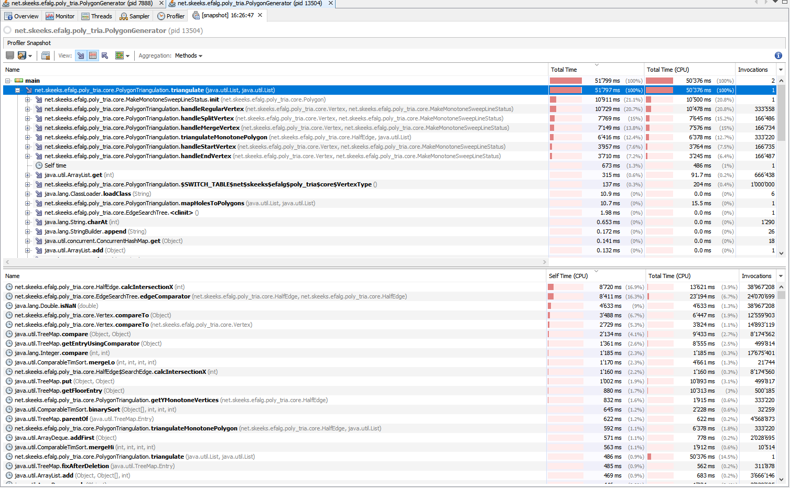

# Polygon Triangulation

## Ausführbare Programme

**`PolygonTriangulationProgram`** liest die Datei `polygon.in` ein und zeigt in einem `JFrame` die Triangulierung all dieser Polygone an.
Mit den Buttons `Next` und `Previous` kann nachvollzogen werden, welche Verbindungskanten eingefügt wurden (+ Reihenfolge). Diese Kanten werden `gelb` dargestellt. Damit lassen sich nur die eingefügten Kanten aus der 1. Phase des Algorithmus anzeigen, da dies für die 2. Phase nicht zuverlässig angezeigt werden kann.
Auch die Kategorien der einzelnen Knoten wird mittels Kreuzen dargestellt:
* Start-Vertex: CYAN
* End-Vertex: GREEN
* Split-Vertex: RED
* Merge-Vertex: ORANGE
* Regular-Vertex: DARK_GREY

**`InteractiveHoleTriangulationProgram`** bietet die Möglichkeit, selbst beliebige Polygon und Löcher zu zeichnen.
Initial lässt sich ein Polygon zeichen (Gegenuhrzeigersinn beachten).
* Mit `Left Click`setzt man einen neuen Knoten
* Mit `Shift+Mousemove`` kann man den zuletzt gesetzten Knoten verschieben
* Mit `Space` kann man ein neues Polygon beginnen
* Mit `N` wechselt man in den Löcher-Modus bzw. zurück.
	* Löcher müssen im Uhrzeigersinn gezeichnet werden.
* Mit `Right Click` kann man wieder von vorner beginnen.

Die Triangulation wird laufen berechnet und angezeigt.
Während des Zeichnens kann es vorkommen, dass ein Polygon oder Loch kurzzeigt ungültig wird (kreuzende Kanten, überlagernde Polygone). Je nach Konstellation endet dies in einer Endlosschlaufe, worauf das Programm neu gestartet werden muss.
Bei jedem Neuberechnen wird in der Konsole Java-Code für einen Unit-Test ausgegeben.

In **ShowJUnitPolygonProgram** können mittels Copy-Paste die Polygons/Löcher aus den JUnit Tests eingefügt und angezeigt werden.

## Kurzbeschrieb Algorithmus
Mein Algorithmus ist ein wenig anders herausgekommen als die Trapezidee von Ihnen. Ich habe mich dabei vor allem an den Erklärungen von Mark de Berg in seinem Buch ["Computational Geometry"](https://archive.org/details/computationalgeo00berg) orientiert.

Der Algorithmus besteht aus 2 Phasen: In der ersten Phase wird das Polygon (inkl. den Löchern) in y-monotone Polygon unterteilt. Kurz gesagt heisst das ich unterteil so, dass es keine Split- oder/und Merge-Vertices mehr gibt. Dies wird damit erreicht, dass ein Split-Vertex immer zum nächstoberen Knoten verbunden wird, der die gleiche Kante als linker Nachbar hat.
Merge-Vertex müssen grundsätzlich gleich behandelt werden (aber auf dem Kopf), jedoch werden diese nachträglich verbunden, da man zum Zeitpunkt der Behandeln des Merge-Vertex die Vertices unterhalb noch nicht kennt/behandelt hat.
Daraus entstehen mehrere Polygone. Jedes davon wird nachher separat trianguliert.

## Kurzbeschrieb Implementation
Die Erklärungen von Mark de Berg haben mir zwar eine Idee gegeben, die Umsetzung war alles andere als einfach.

 - Bestimmen der Knoten-Typen: Hier muss `Math.atan2` verwendet werden, um den Innenwinkel zu bestimmen.
 - Active Set der Kanten: In der ersten Phase muss jeweils eruiert werden können, welche Kante links von einem Vertex auf Sweep Line liegt. Hier habe ich lang herumgetüftelt. Schlussendlich verwende ich nun eine [`NavigableSet`](https://docs.oracle.com/javase/8/docs/api/java/util/NavigableSet.html). Die Ordnung bestimmt sich aus der x-Koordinate der Kanten auf der Sweep Line. Jedoch müssen nicht immer die x-Koordinaten aller aktiven Kanten berechnet werden, sondern nur `O(log n)` Kanten (beim Einfügen und Suchen). Denn die Ordnung der bereit eingefügt Kanten ändert sich nich, da sich diese nicht kreuzen.
 - Werden Verbindungskanten in der ersten Phase eingefügt, dann muss mein Algorithmus für die 2. Phase die Teilpolygone kennen. Dazu verwende ich eine Doubly Connected Edge List. Jede "Linie" wird von 2 Halb-Kanten repräsentiert (in beide Richtung). Jede dieser Halb-Kanten gehört zu einer Fläche. Die Anzahl Flächen entspricht dann nach der ersten Phase genau der Anzahl y-monotoner Polygone, die noch trianguliert werden müssen.
 - Um eine Verbindungskanten einzufügen, müssen die richtigen Next/Previous Halb-Kanten der beiden Knoten, die verbunden werden sollen, gefunden werden. Gibt es Löcher, kann es sogar mehrere Next/Previous Paare für die gleiche Fläche geben. Glücklicherweise kennt man als Anhaltspunkt die Kante, welche links der beiden Knoten liegt, verwenden. Dies gehört immer zur richtigen Fläche und man muss folglich nur von dieser Kante aus weiterlaufen bis man zum richtigen Knoten und somit zu den richtigen Next/Previous Halbkanten kommt.
 - Der Hauptalgorithmus der 1. Phase ist auch für Löcher genau gleich. Der einzige Unterschied ist beim `MakeMonotoneSweepLineStatus.init`. Löcher müssen anders als das Polygon in die `DCEL` eingefügt werden. Der Hauptunterschied liegt darin, dass die Klassifizierung der Knoten genau umgekehrt ist (z.B. Aussenwinkel statt Innenwinkel).
 - Zuweisen der Fläche bei Halb-Kanten von Löchern: Wenn eine Verbindungskante eingefügt wird, entsteht dadurch meistens eine 2 Fläche. Die Kanten, welche zu dieser Fläche gehören sollen, müssen mit dieser neuen Fläche aktualisiert werden. Dies kann man für den einfachen Fall mit dem entlanglaufen der Kanten lösen. Die klappt nicht für die Halbkanten von Löchern. Meine Lösung dazu ist, dass der erste Knoten eines Loches schaut, welche Kante links davon liegt, und dann alle Kanten des entsprechenden Lochs auf die Fläche aktualisiert.

 

## Korrektheit

### Validierung

Die Polygons werden bei der Eingabe nicht validiert. Trotzdem müssen sie folgende Bedingungen erfüllen:

- Die Kanten dürfen sich nicht überschneiden.
- Die Polygons dürfen sich untereinander nicht schneiden.
- Ein Loch muss ganz innerhalb eines (und nur eines) Polygons liegen.
- Punkte im Polygon dürfen nicht doppelt aufgelistet werden.

### Unit Tests
Ich verwende einige Tests um die Datenstruktur `DCEL`, `Edge`, `Polygon` und `MakeMonotoneSweepLineStatus` zu testen. Dies sind aber nur relativ einfach Tests.
In `TriangulationWithoutHolesTest` und `TriangulationWithHolesTest` werden eine Vielzahl von Polygons getestet. Diese habe ich mittels dem `InteractiveHoleTriangulationProgram` erstellt. So konnte ich von Auge verifizieren, dass die Triangulation korrekt war und dann als Unit-Test ablegen.

Auch das `PolygonTriangulationProgram` kann als Unit-Tests angesehen werden, da dort noch weitere Polygons trianguliert werden.

 ### Coverage
 Der Algorithmus selbst (hauptsächlich das Package `core`) hat eine Coverage von beinahe 100%.
 Die wenigen Ausnahmen wurden analysiert und womöglich weitere Unit-Tests hinzugefügt. Einzelne Zeilen werden in den Tests trotzdem nicht getestet, da diese Zeilen sowie einen Fehler auslösen würden.

### Asserts
Mittels assert-Statements werden im Code des Algorithmus Annahmen und Invarianten überprüft.

### PVS Studio
PVS-Studio wurde durchgeführt, um allfällige Code-Smells zu beseitigen.

## Skalierbarkeit

### Laufzeit
Die theoretische Laufzeigt beträgt `O(n log(n))`.

Ein Loch zu identifizieren dauert `O(v)` (`Polygon.isClockwise()` pro Polygon, also schlimmstenfalls `O(p*v*l)` (p=Anzahl Polygon, l=Anzahl Löcher, v=durchschnittliche Knotenanzahl).

Der Algorithmus trianguliert jedes Polygon einzeln.

**Triangulierung eines einzelnen Polygons (inkl. alle dazugehörigen Löcher)**

v=Anzahl Knoten des Polygons und der dazugehörigen Löcher

- Das Sortieren in `MakeMonotoneSweepLineStatus.init` dauert `O(v log v)`
- Das Suchen der nächst-linken Kanten über das Tree-Set ist `O(log n)` (Rot-Schwarz-Baum von TreeMap). Auch das Einfügen ist `O(log n)`
	- Deshalb dauert das Abhandeln eines Events/Vertex nur `O(log v)`
- Das Einfügen einer Verbindungskante kann bis zu `O(v)` dauert konstante Zeit. Es müssen nur 2 Halb-Kanten für die neue Verbindung erstellt werden.

Fazit: Der Algorithmus braucht ca. `O(v log v)` um ein einzelne Polygon (inkl. Löcher) zu triangulieren.

### Analyse mit VisualVM CPU Time

Die Analyse mit VisualVM bein einem grossen Polygon war sehr hilfreich. Ich konnte meinen Algorithmus stark optimieren.
Vor der Optimierung benötigte er für 100'000 Knoten ca. 15s, danach nur noch eine halbe Sekunde.

In einem Polygon von einer grösse mit 1 Mio. Knoten habe ich nun folgende Analyseresultate bekommen:

Interessant ist hier, das praktisch alle Methoden, die häufig aufgerufen werden bzw. viel Zeit benötigen, entweder vom initialen Sortieren der Knoten stammt oder vom Einfügen/Suchen im `EdgeSearchTree`.

Diese hohe Zeit für den `EdgeSearchTree` ist auch nicht allzu verwunderlich, denn die horizontale Struktur des Graphes bedeutet das sehr viele Edges gleichzeit in diesem Tree sind und die Suchzeit dementsprechend steigt.

### Benchmark

Für den Benchmark habe ich die Klasse `PolygonGenerator` erstellt. Diese erzeugt ein Polygon mit einer gewissen Anzahl Knoten. Die erste Hälfte der Knoten liegt unterhalb des zweiten Hälfte. Jeder Knoten hat einen Raum von 100x und 400y zu Verfügung, wo er sich zufällig eine Position sucht. So entstehen die verschiedenen Arten von Knoten. Bei einer Grösse von 5 Mio. Knoten gibt es zum Beispiel ungefähr 1.5Mio Split und Merge Knoten.

Der Benchmark testet ein solches Polygon mit 3 unterschiedlichen Grössen (Anmerkung: Für jede Grösse ist zwar das Schema gleich, die einzelnen Knoten sind aber nicht an selber Stelle):
- 1 Million Knoten
- 2 Millionen Knoten
- 5 Millionen Knoten 

**Resultate**

Die Laufzeit sollte ungefähr `O(n log(n)` betragen, wobei `n` für die Anzahl Knoten steht.

| Knoten  | Laufzeit    | Faktor      |
|---------|-------------|-------------|
| 100000  | 500000      |             |
| 1000000 | 6000000     | 12          |
| 2000000 | 12602059.99 | 2.100343332 |
| 5000000 | 33494850.02 | 2.657886889 |

Mit den Resultate des Benchmarks kann nun verglichen werden, ob der Faktor ungefähr dem erwarteten Faktor entspricht.

| Benchmark                                     | Scoe      | Unit  | Faktor      | Erwarteter Faktor |
|-----------------------------------------------|-----------|-------|-------------|-------------------|
| TriangulationBenchmark.triangulation100_000   | 133.485   | ms/op |             |                   |
| TriangulationBenchmark.triangulation1_000_000 | 2322.06   | ms/op | 17.39566243 | 12                |
| TriangulationBenchmark.triangulation2_000_000 | 5100.51   | ms/op | 2.196545309 | 2.100343332       |
| TriangulationBenchmark.triangulation5_000_000 | 14643.319 | ms/op | 2.870951924 | 2.657886889       |

Die Faktoren sind zwar leicht darüber, aber man sieht das der Algorithmus ungefähr in dieser Grösserordnung skaliert.
Die Faktor von 100'000 auf 1'000'000 Knoten lässt sich wahrscheinlich dadurch erklären, dass bei 100'000 Knoten der L1,L2,L3 Cache noch eine grössere Auswirkung haben (bzw. beim 1Mio Knoten der Cache nicht mehr genug gross ist).

### Speicherverbrauch

Während des Programmieres habe ich darauf geachtet, nicht immer neue Objekte zu erstellen. So wird zum Beispiel für die 2. Phase der ChainType im selben Vertex gespeichert.

Ich habe auch darauf geachtet, beim Erstellen der Sweep-Line-Event-Liste `Arrays.sort` statt `Collections.sort` zu benutzen, da die zweite Variante die Liste zuerst in ein Array kopiert und dementsprechend kurzzeitig sehr viel Speicher brauchen kann.

#### Analyse mit VisualVM Speicherverbrauch

Mit VisualVM habe ich diesmal auch den Speicherverbrauch für den Algorithmus gemessen.

Wie erwartet benötigt `HalfEdge` am meisten Speicher. Logisch, denn für jede Kante werden 2 Objekte davon erstellt. Bei einem Polygon mit 1 Mio Knoten sind das schon 2Mio. Die zusätzlichen 600k stammen von den eingefügten Verbindungskanten (d.h. es gibt ca. 300 Verbindungskanten). Hier gäbe es sicherlich auch noch Optimierungen, z.B. könnte man das `next` eines Vertex wahrscheinlich weglassen.

Am zweitmeisten benötigt `Triangle`, was nur logisch ist.
Anzumerken ist hier noch die Klasse `Edge` nur für die Fortschrittsanzeige implementiert wurde, man sollte sie also nicht berücksichtigten.

